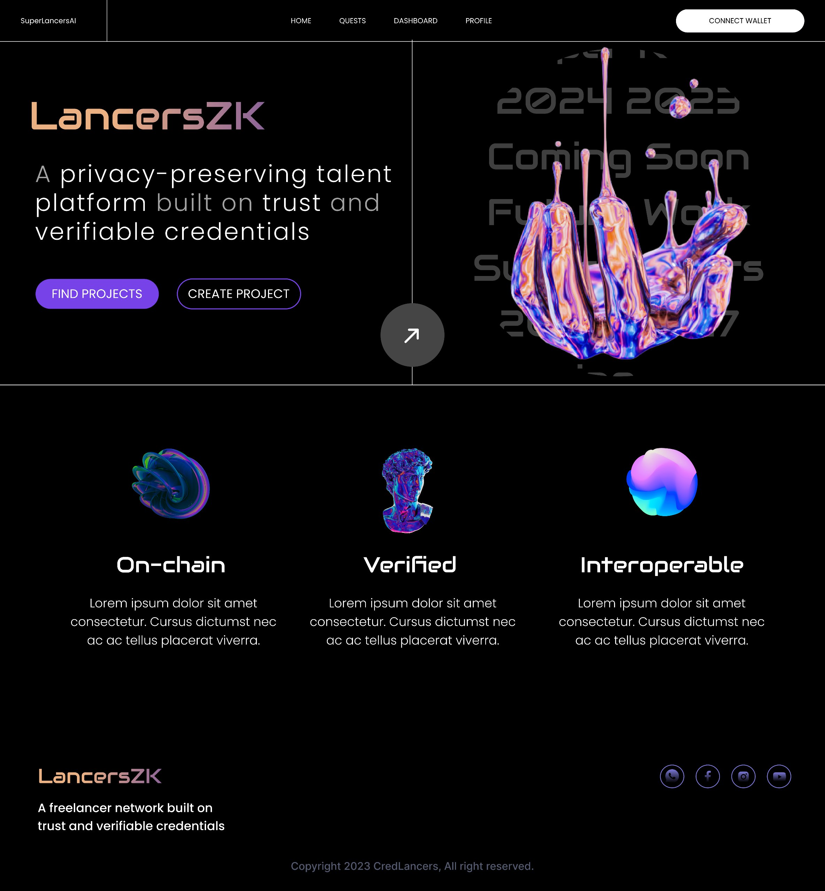
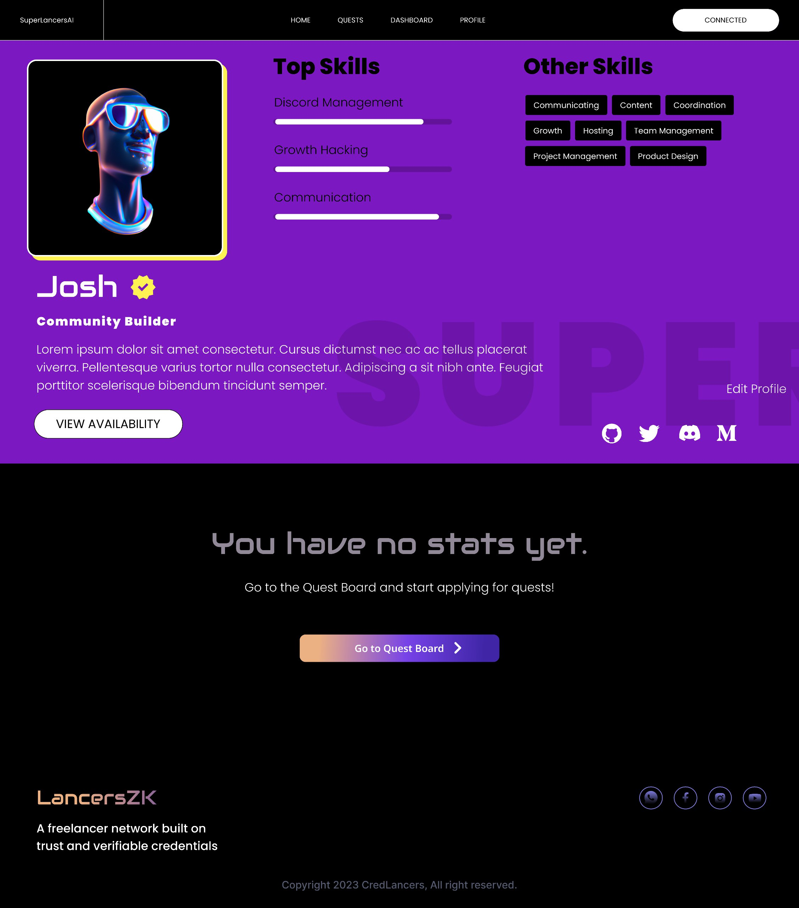
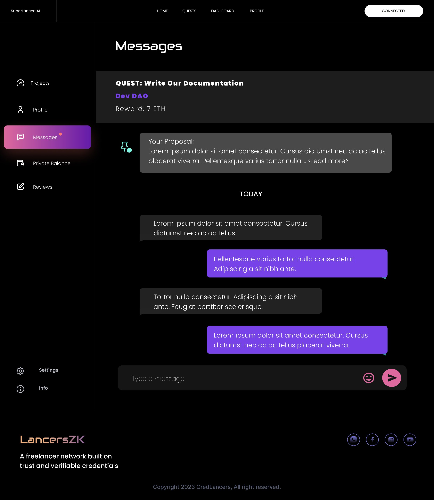
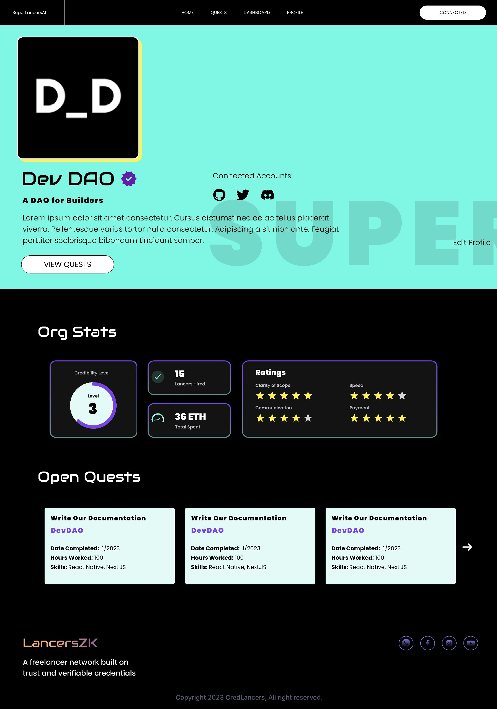
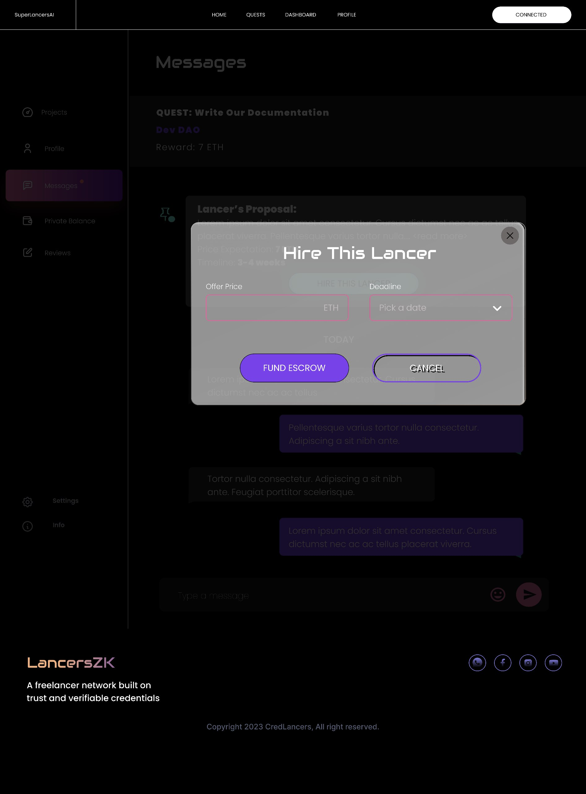
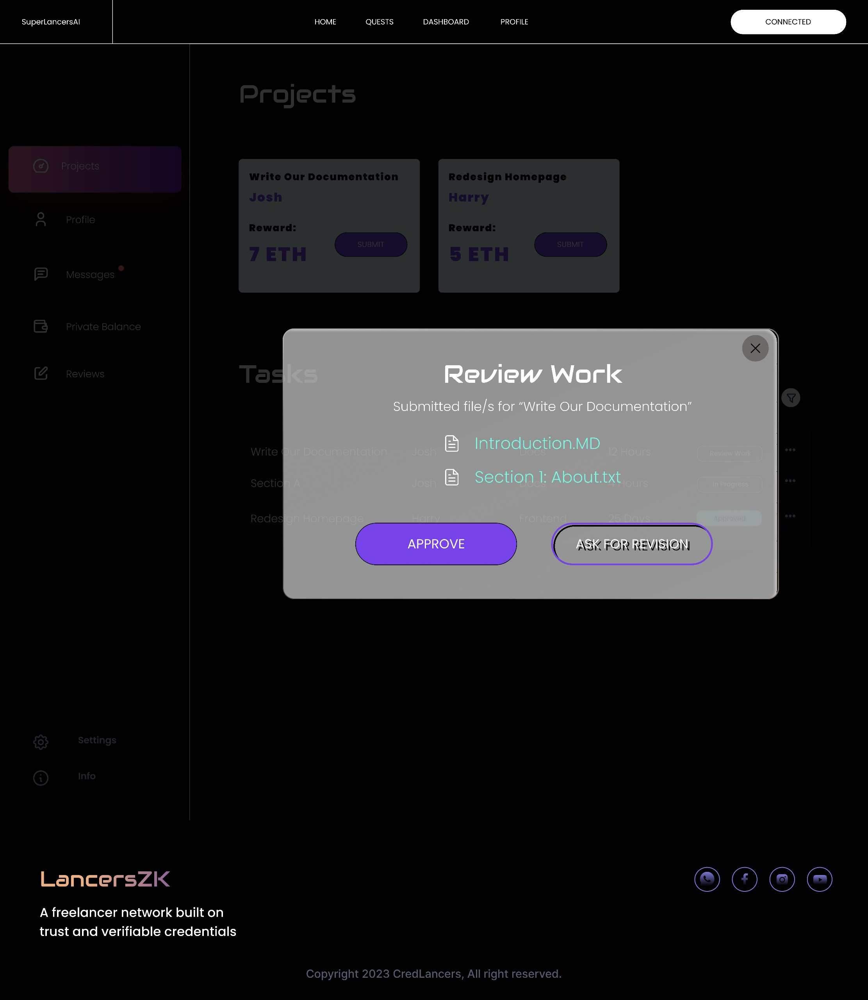

# LancersZK

## Project Description
LancersZK is a pioneering on-chain freelancing platform that offers a trustless solution for tapping into the talent market, featuring decentralized private payments and verifiable credentials.

## Unique Value Proposition

While many on-chain talent markets focus on identities and credentials, LancersZK has these as basic features AND will be the first to focus on UX and ease of use to a wider userbase.

We make it easy to transact inside the protocol by providing interoperable payments across different chains. And our digital reputation framework preserves privacy in payments, invoicing and encourages anonymous feedback.

Self sovereign identities and verifiable credentials are also a core feature of LancersZK, and we are leveraging Polygon's zkEVM and Polygon ID to make it possible to mint NFT credentials on-chain in a decentralized manner transparent trustless manner.

All these features work well together to create a reimagined workplace for the on-chain future.

## Problems We're Solving

40% of people lie on their resumes, and three out of four employers have caught a lie on someone's resume. With on-chain actions in LancersZK leaving a digital trail for everyone's skills and activities, people can make sure that user profiles are 
always accurate and truthful.

There is no decentralized job platform that allows for private transactions, and this could basically lead to issues like the whole public seeing how much you earn for a living. LancersZK solves this by enabling private transactions and even private 
job postings.

## Key Features:

- Seamless cross-chain payments for ease of transactions.
- A digital reputation framework ensuring privacy in payments, invoicing, and encouraging anonymous feedback.
- Self-sovereign identities and verifiable credentials, utilizing Polygon's zkEVM and Polygon ID for decentralized NFT credential minting.
These features work cohesively to redefine the future of on-chain work environments.

## Project structure
- `credLancer_cross_chain` has the contracts for :
  - Cross-chain transactions using chainlink CCIP.
  - Polygon ID's Verifiable Credentials
  - Polygon zkEVM
- `Credlancer_Privacy` has contracts and all logic related to private payments through `TalentLayerID` and `RequestNetwork`
- `Credlancer_Update` has contracts and all logic related to public payments

## Public and Private payment methods
 LancersZK supports both public and private payments.

----------------------------------------------------------------
### Private Payment methods
### Why we need it ?
- Privacy concerns in professional networks and marketplaces
- Need for efficient matching and discovery without compromising privacy
- Inadequate security and privacy in payment infrastructure

  
#### How it works
1. 
    1. A Freelancer creates an ID using **TalentLayerID, we hope to integrate ENS** 
    2. Both Orgs and Freelancers will have a **Railgun** wallet to preserve privacy of transactions
    3. On the Quest Board publically available quests are displayed. 
    4. To show interest for a Quest, Alice initiates the **Waku** chat to privately negotiate with the Org who added it… ******************************************type time availability & price expectation******************************************
    5. The Org saw my onchain reputation, which came from our **Subgraph (The Graph)**, so they approved me for this Quest. Now the escrow is funded via a **Railgun** private transaction and I can see the Quest in my Dashboard
    6. Once I’m done, I mark the Quest as complete, which sends a **Railgun** encrypted invoice to the Org via **Request Network**
    7. The Org will now check my work and hopefully approve using **Request Network**. Ok, it’s been approved, which triggers an Experience Credential (EC) for project completion.
    8. Now the Org and I can give a vote to eachother using **Semaphore Protocol**.
#### How it's Made
We used the following technologies to build LancersZK:

- **TalentLayerID** contract to set up a social id upon registration, which then manages job requests and proposals
- **Railgun Protocol**: both our user personas, Orgs (DAO) and Freelancers, need a Railgun wallet to interact with our dApp. The UI allows for a new user to use an existing Railgun wallet using WalletConnect, or create a new Railgun wallet using a Metamask wallet. Next, the Org can send a shielded transaction to an escrow smart contract upon confirming a Freelancer to work on a Quest. Once the funds are released from the escrow account they are stil zk-snark encrypted all the way to the Freelancer’s Railgun wallet.
- **Waku**: we used the communication protocols of waku to provide a robust and censorship-resistant realtime messaging chat, focusing on privacy and decentralized communication features for users.
- **Request Network**: Once the Freelancer has completed the work, they send an invoice to the Org using Request Network tooling (previously encrypted by Railgun). Next, Request Network allows the Org to check and confirm whether the specification of work was met. Once approved, the escrow payment is released.
- **The Graph**: Subgraph for custom TalentLayer contracts
- **Semaphore Protocol**: At Quest completion, upon payment both parties can provide an anonymous onchain review to eachother using Semaphore Protocol, which is not directly revealed. Instead, we will reveal the ratio of quantified review score to the average score, thereby providing useful information without breaking privacy.

- **Filecoin** - We needed decentralized storage to store files and nft credentials, so we used Filecoin for efficient storage solution. We also leveraged IPFS (InterPlanetary File System) with NFT.storage to ensure fault tolerance and high availability 
for users' files.

- **The Graph Protocol** - We used subgraphs to query reviews for DAOs and Freelancers, and also query projects of freelancers

### Public methods
 Public payments are made through on-chain contracts with cross-chain functionality leveraged by Chainlink CCIP. 
#### How it Works

1. Freelancer signs up and writes a basic description and skills list to attract potential clients. There is no credentials on his profile yet, because it will only be filled through NFTs issued by verified organizations.

2. He then applies for 'Quests' by initiating the Waku chat to privately discuss and negotiate the details of the job. The organization funds the escrow before awarding the job to him.

3. Lancer submits his work by marking the quest completed, which then sends an invoice to the org via Request Network. If approved by the Org, the escrow is released and the platform mints an NFT credential to the Lancer which is then displayed in his 
profile.

#### How it's Made
We used the following technologies to build LancersZK:

- **Chainlink CCIP** - Harness the potential of Chainlink CCIP for frictionless cross-chain transactions, enabling secure and efficient interactions across different blockchain networks. Creating quest which include Payments to Lancers can be made either cross-evm chain to make the crypto transactions much more seamless for the users. We are also using CCIP for cross-chain posting of quests for liquidity effecinacy and better user experience ;Orgs don't have to switch chains just to post.
- **Polygon ID's Verifiable Credentials**  n ZKHack, we're seamlessly integrating Polygon ID to serve as a means of representing identity-based information as verifiable credentials. This makes Lancers with verified Polygon IDs eligible for minting Credential NFTs, empowering them to participate in any Quest with confidence
- **Polygon zkEVM** - We are deploying our contracts on Polygon zkEVM for seamless performance, EVM-equivalence, and securing transactions with Ethereum's consensus.

- **Filecoin** - We needed decentralized storage to store files and nft credentials, so we used Filecoin for efficient storage solution. We also leveraged IPFS (InterPlanetary File System) with NFT.storage to ensure fault tolerance and high availability 
for users' files.

- **The Graph Protocol** - we used subgraphs to query reviews for DAOs and Freelancers, and also query projects of freelancers

----------------------------------------------------------------

## Demo/ Gallery 

-----------------
LancersZK is leading the way in reimagining the freelancing landscape by prioritizing privacy, accuracy, and user experience. Join us on this innovative journey as we revolutionize on-chain work environments and empower users with a trustless, private, and secure platform.

